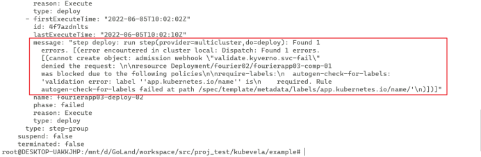

# integrate a kubernetes policy management tool into KubeVela

`Kyverno` and `gatekeeper` are the two header kubernetes policy management projects of CNCF.
As for kubernetes policy management tool, we focus on `Kyverno` and `Gatekeeper` and prefer `Kyverno`.

## Why we need Kyverno?
Kyverno is a kubernetes policy management tool, it runs as a dynamic admission controller in a Kubernetes cluster.
Kyverno allows cluster administrators to manage environment specific configurations independently of workload configurations and enforce configuration best practices for their clusters. 
Kyverno can be used to scan existing workloads for best practices, or can be used to enforce best practices by blocking or mutating API requests.

## Why we select Kyverno to integrate?
After comparing with gatekeeper, We have the following points.
- Gatekeeper was born in July 2017, and has 2.6k star. Kyverno was born in May 2019, and has 2.5k star.
- Gatekeeper needs to write `rego` for configuring policy. Kyverno only needs to write `yaml` and meet most needs.
- Kyverno has two modes, enforce and audit. This provides more options for user.

## How to integrate Kyverno to KubeVela?
- Kyverno integrate KubeVela via a `polocy-definition` like `kyverno-policy`.
- The keyverno declared in kyverno policy in each application corresponds to a keverno `clusterpolicy` or `policy`(ns level).
  - At the same time, if the declared scope is a resource type, these keyverno policies can take effect together.
  - If the declared scope is a specific resource, it will take effect independently for this resource.
- In the `enforce` mode, the check error message can be fed back to the application through the workflow message.
图片
- In audit mode, query check information through vela cli, such as `vela kyverno info <app-name>`
- just as @Somefive said, if we have enough community participation, we can integrate `Gatekeeper` or other any policy management tools as `polocy-definition`. 

## Potential optimization points
- Rules checking is completed after application deployment. We hope to find a way to complete rules checking before application deployment
- `vela policy` need to support dispatch k8s resource and feedback the process.

## Additional context
related issues https://github.com/kubevela/kubevela/issues/2371

每个Application中的kyverno-policy中声明的keyverno对应一个keverno ClusterPolicy或Policy（ns级别）；
同时如果声明的范围是资源类型，那么这些keyverno的策略是能够共同生效的；
如果声明的范围是具体某个资源，则对这个资源独立生效
在enforce模式下，校验错误信息能够通过workflow的message反馈到application
在audit模式下, 通过vela cli查询policy的审计信息,如 `vela kyverno info <app-name>`

潜在的问题：
rules 检查是在application部署后完成的，我们希望找到一种方式能够在能够application部署前完成rules检查

1，做成一个部署的policy，core需要有哪些支持；
2，做成一个policy的机制是什么；
3，enforce错误如何反馈上来。
4，audit如何查看错误信息。
5，有没有方式在部署前检验，不需要部署后再返回。

另外，从为什么做（背景和问题），到vela 做这个的优势（价值），到怎么实现，
再到未来的人怎么扩展（扩展分两个方面，一个是实现层可以扩展不同的策略系统，另一个是单个策略系统比如 kyverno也有不同的策略可以集成）。
如果设计过程中觉得有需要core 配合的点，也可以写上 core 需要什么改动.