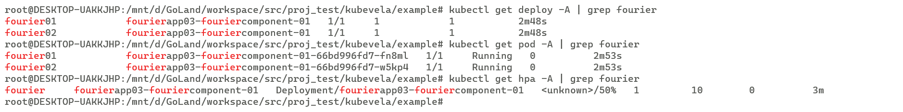

**Is your feature request related to a problem? Please describe.**


By default, traits cr are dispatched to managed clusters along with component, and we want the ability for traits to be dispatch to hubcluster.


**Describe the solution you'd like**

Firstly, add a new field `hubClusterDispatchOnlyEnabled` in the trait-definition and applicationrevision to identify whether the trait is delivered to the hubcluster
```yaml
            spec:
              description: A TraitDefinitionSpec defines the desired state of a TraitDefinition.
              properties:
                appliesToWorkloads:
                  items:
                    type: string
                  type: array
                conflictsWith:
                  description: 'ConflictsWith specifies the list of traits(CRD name,
                  Definition name, CRD group) which could not apply to the same workloads
                  with this trait. Traits that omit this field can work with any other
                  traits. Example rules: "service" # Trait definition name "services.k8s.io"
                  # API resource/crd name "*.networking.k8s.io" # API group "labelSelector:foo=bar"
                  # label selector labelSelector format: https://pkg.go.dev/k8s.io/apimachinery/pkg/labels#Parse'
                  items:
                    type: string
                  type: array
                manageWorkload:
                  description: ManageWorkload defines the trait would be responsible
                    for creating the workload
                  type: boolean
                podDisruptive:
                  description: PodDisruptive specifies whether using the trait will
                    cause the pod to restart or not.
                  type: boolean
                revisionEnabled:
                  description: Revision indicates whether a trait is aware of component
                    revision
                  type: boolean
                hubClusterDispatchOnlyEnabled:
                  description: hubClusterDispatchOnlyEnabled indicates which cluster is dispatched to
                  type: boolean
```
Secondly, deploy the hubcluster trait cr separately
```go
		readyWorkload, readyTraits, err := renderComponentsAndTraits(h.r.Client, manifest, appRev, overrideNamespace, env)
		if err != nil {
			return nil, nil, false, err
		}
		checkSkipApplyWorkload(wl)
		dispatchResources, hubClusterOnlyTraits := checkHubClusterOnlyTraits(wl.Traits, readyTraits, af.Namespace)
		if !wl.SkipApplyWorkload {
			dispatchResources = append(dispatchResources, readyWorkload)
		}

		if err := h.Dispatch(ctx, clusterName, common.WorkflowResourceCreator, dispatchResources...); err != nil {
			return nil, nil, false, errors.WithMessage(err, "Dispatch")
		}
		localCtx := multicluster.ContextWithClusterName(ctx, "local")
		if err := h.Dispatch(localCtx, "local", common.WorkflowResourceCreator, hubClusterOnlyTraits...); err != nil {
			return nil, nil, false, errors.WithMessage(err, "Dispatch")
		}
```
Thirdly, some examples are as follows

An example of hubClusterDispatchOnlyTrait `hubcpuscaler` is as follows
```cue
hubcpuscaler: {
	type: "trait"
	annotations: {}
	labels: {
		"ui-hidden": "true"
	}
	description: "Automatically scale the component based on CPU usage."
	attributes: {
		appliesToWorkloads: ["deployments.apps"]
		hubClusterDispatchOnlyEnabled: true
	}
}

template: {
	outputs: hubcpuscaler: {
		apiVersion: "autoscaling/v1"
		kind:       "HorizontalPodAutoscaler"
		metadata: name: context.name
		spec: {
			scaleTargetRef: {
				apiVersion: parameter.targetAPIVersion
				kind:       parameter.targetKind
				name:       context.name
			}
			minReplicas:                    parameter.min
			maxReplicas:                    parameter.max
			targetCPUUtilizationPercentage: parameter.cpuUtil
		}
	}

	parameter: {
		min: *1 | int
		max: *10 | int
		cpuUtil: *50 | int
		targetAPIVersion: *"apps/v1" | string
		targetKind: *"Deployment" | string
	}
}
```
An example of application with hubClusterDispatchOnlyTrait `hubcpuscaler`  is as follows
```yaml
apiVersion: core.oam.dev/v1beta1
kind: Application
metadata:
  name: fourierapp03
  namespace: fourier
spec:
  components:
    - name: fourierapp03-fouriercomponent-01
      type: webservice
      properties:
        image: busybox:latest
        imagePullPolicy: IfNotPresent
        cmd: [ "sleep", "1000000000" ]
        cpu: "0.1"
        mem: "100Mi"
      traits:
        - type: hubcpuscaler
          properties:
            min: 1
            max: 10
            cpuPercent: 60
        - type: annotations
          properties:
            abc: "def"
        - type: expose
          properties:
            port: [ 80 ]
  policies:
    - name: fourierapp03-topology-01
      type: topology
      properties:
        clusters: [ "kind01" ]
        namespace: fourier01
    - name: fourierapp03-topology-02
      type: topology
      properties:
        clusters: [ "kind02" ]
        namespace: fourier02
  workflow:
    steps:
      - type: deploy
        name: fourierapp03-deploy-01
        properties:
          policies: [ "fourierapp03-topology-01","fourierapp03-topology-02" ]
```
**Describe the situation you'd expected**


**Additional context**
- HubClusterDispatchOnlyTraits does not currently support deployment in the form of helm release, Git Repo, etc.


- Reply to 1.
Whether a trait is dispatched to the hub cluster is defined by the developer of the trait, not by the person using the trait.
If a trait wants to be dispatched to the hub cluster, at the same time want to be dispatched to the managed cluster, I think there are only two traits with different controlPlaneOnly values.
Therefore, there is no situation in which a trait is initially deployed in cluster-a and then deployed in local. These two situations are isolated.
- Reply to 2.
Traits deployed to hubclutser are separate from normal traits and workloads to be dispatched. so the ResourceTracker.ManagedResource can record the cluster,ns,component.
I have implemented it and verified that it is fully compatible with the original resourcetracker dispatch, GarbageCollect
deploy the hubcluster trait cr separately
- Reply to 3.
If a trait contains multiple resources, I think it is possible to divide a trait into multiple trait implementations and deploy only a part of the cr in the hubcluster.
- Reply to 4.
Regarding annotations, it is simple, convenient and efficient. If it is a platform resource, we think it is acceptable to add annotations, but we do not think it is necessary to add annotations to user resources.
- Reply to 5.
About the Terraform typed component.
I'm not sure if it means helm release, Git Repo, if so, I think it can be achieved in this way. 
Because I don't know much about helm component, I haven't implemented it for now, I will support helm release, Git Repo in another pr in the future

1、一个trait应该被部署到管理集群还是业务集群应该由开发trait的人员决定，而不是由使用tarit的人决定。并且一个trait想同时部署到管理集群和业务集群的话，应该由两个具有不同的controlPlaneOnly的trait来实现，我认为同时部署到管理集群和业务集群的这种情况是不存在的。
因此，也就不会存在一个trait一开始部署在业务集群，后来部署在管理集群这种情况，这种情况只能通过两个trait的部署-回收来实现。
2、hubclustertrait的部署和普通trait是分开的，因此ResourceTracker.ManagedResource能够记录对应的cluster,ns,component等信息，也就不会影响dispatch, GarbageCollect，并且我也已经做了实现，rt的GarbageCollect能够回收hubclustertrait，完全兼容。
3、一个trait里多个资源，部分部署到local，我觉得可以通过分拆trait来实现，有一点不优雅
4、关于通过注解实现，我们觉得如果是平台的资源，增加注解是可接受的，但是对于用户的资源，非必要情况下不增加注解、标签，不太能接受
5、关于Terraform typed component 我不确定是不是指的是通过helm release, Git Repo的component，如果是的话，也完全可以通过这种方式实现。
因为我对helm release, Git Repo部署的component不太了解，所以暂时没有实现它，后边可以在的另一个pr中支持helm release, Git Repo