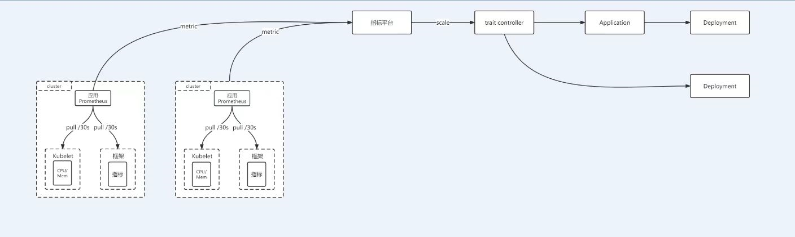

# 基于KubeVela的弹性扩容容实践

## 现状与问题

现有容器平台有原生k8s的HPA，没有大规模使用，仅有小部分使用了cpu HPA

- k8s HPA比较难与vela相结合，包括crane、KEDA等
- k8s 的 HPA 作为基础设施部署在每个业务集群，对于大规模集群不方便管理，后续不方便支持基于预测的弹性伸缩

## 实践

**周期弹性伸缩**


**指标弹性伸缩**




```yaml
metric:
  metricTarget:
    uuid: "51745c0e-c945-433c-a028-4d5dfd6a5a38"
    metricReplicas: 1
    metricCPU: "1"
    metricMemory: "1Gi"
  triggers:
  - type: cpu
    metricType: Utilization
    minValue: 60
    maxValue: 80
    timeWindow: 300
  - type: memory
    metricType: Utilization
    minValue: 60
    maxValue: 80
    timeWindow: 300
config:
  priorityStrategy: "ReplicasOnly" # ReplicasOnly、ReplicasFirst、CPU&MemoryOnly、CPU&MemoryFirst
  cooldownPeriod: 600
  coolupPeriod: 60
  maxCPU: "8"
  maxMemory: "8Gi"
  maxReplicas: 8
  minCPU: "0.2"
  minMemory: "200Mi"
  minReplicas: 1
  externalKey: "JAVA-OPTS"
  externalValue:
    jdkVersion: "1.8"
    reservedMemory: 10
    directMemory: 10
    heap: 65
    metaspace: 10
    native: 15
    stack: 10
```